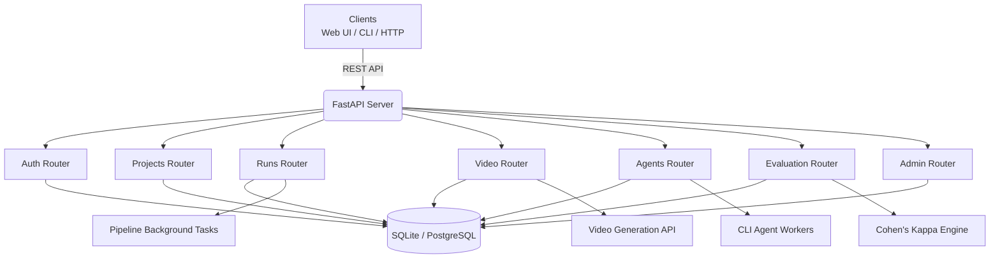

# 🚀 DevOps Agent — Multi-Agent DevOps Automation Platform


## 🏗️ Architecture




```
┌─────────────────────────────────────────────────────────────┐
│                     Clients                                 │
│              Web UI / CLI / HTTP API                        │
└─────────────────────────┬───────────────────────────────────┘
                          │ REST API
                          ▼
┌─────────────────────────────────────────────────────────────┐
│              FastAPI Application                            │
│  Auth ── Projects ── Runs ── Video ── Agents ── Eval ── Admin│
└─────────────────────────┬───────────────────────────────────┘
                          │ SQLAlchemy ORM
                          ▼
┌─────────────────────────────────────────────────────────────┐
│            SQLite / PostgreSQL Database                     │
└─────────────────────────────────────────────────────────────┘
```

## ✨ Features

- 🔐 JWT Authentication & User Management
- 📁 Project Management with GitHub Integration
- 🏃 Pipeline Runs with Background Task Processing
- 🎥 Async Video Generation Pipeline
- 🤖 Multi-Agent Registry with Heartbeats
- 📊 Cohen's Kappa Evaluation Framework
- 🛡️ Admin Health & Stats Monitoring
- 🧪 Full Test Coverage (22 tests + HTTP smoke tests)
- 🛡️ Security Headers, Rate Limiting & Max Body Size Protection
- 🔑 API Key Authentication (service-to-service auth)
- 🗄️ Alembic Database Migrations (safe schema evolution)
- 🔄 Soft Deletes & Audit Logging (recoverable data changes)
- ⚡ Circuit Breakers & Request Timeouts (reliability)
- 📈 Prometheus Metrics Export (`/metrics` endpoint)
- 🔬 Deep Health Checks (`/ready`, `/health/deep` with DB + Redis + external API diagnostics)

## 📡 API Quick Start

```bash
# 1. Start server
python main.py --mode server --port 8000

# 2. Register
curl -X POST http://localhost:8000/api/v1/auth/register \
  -H "Content-Type: application/json" \
  -d '{"email":"alice@test.com","password":"secret123"}'

# 3. Login
curl -X POST http://localhost:8000/api/v1/auth/login \
  -d "username=alice@test.com&password=secret123"

# 4. Create project
curl -X POST http://localhost:8000/api/v1/projects/ \
  -H "Authorization: Bearer <TOKEN>" \
  -H "Content-Type: application/json" \
  -d '{"name":"demo","repo_url":"https://github.com/demo/app"}'

# 5. Start run
curl -X POST http://localhost:8000/api/v1/runs/ \
  -H "Authorization: Bearer <TOKEN>" \
  -H "Content-Type: application/json" \
  -d '{"project_id":1,"config":{},"no_heal":true}'

# 6. Video job
curl -X POST http://localhost:8000/api/v1/video/jobs \
  -H "Authorization: Bearer <TOKEN>" \
  -H "Content-Type: application/json" \
  -d '{"prompt":"Generate demo","project_id":1}'

# 7. Register agent
curl -X POST http://localhost:8000/api/v1/agents/ \
  -H "Authorization: Bearer <TOKEN>" \
  -H "Content-Type: application/json" \
  -d '{"name":"agent-1","capabilities":"[\"docker\"]"}'

# 8. Heartbeat
curl -X POST http://localhost:8000/api/v1/agents/1/heartbeat \
  -H "Authorization: Bearer <TOKEN>" \
  -H "Content-Type: application/json" \
  -d '{"status":"busy"}'

# 9. Evaluation
curl -X POST http://localhost:8000/api/v1/evaluation/ \
  -H "Authorization: Bearer <TOKEN>" \
  -H "Content-Type: application/json" \
  -d '{"predictions":[1,0,1,1,0],"ground_truth":[1,0,1,0,0],"project_id":1}'

# 10. Health
curl http://localhost:8000/api/v1/admin/health
```

### API Key Authentication

```bash
# Generate API key (shown once)
curl -X POST http://localhost:8000/api/v1/auth/api-keys/ \
  -H "Authorization: Bearer <TOKEN>" \
  -H "Content-Type: application/json" \
  -d '{"name":"ci-key"}'

# Use API key directly — no JWT needed
curl http://localhost:8000/api/v1/projects/ \
  -H "X-API-Key: da_ifhZ5T84ap22gBnF_qke7Mb5IlZwNzMC-PKlbbBmczE"
```

### Production Monitoring

```bash
# Prometheus metrics
curl http://localhost:8000/metrics

# Readiness check
curl http://localhost:8000/api/v1/admin/ready

# Deep health with latencies
curl http://localhost:8000/api/v1/admin/health/deep
```

## 🗂️ Project Structure

```
src/
├── api/
│   ├── main.py
│   ├── dependencies.py
│   ├── middleware.py
│   ├── rate_limit.py           # NEW
│   ├── security_middleware.py  # NEW
│   ├── metrics_middleware.py   # NEW
│   ├── audit_middleware.py     # NEW
│   └── routers/
│       ├── auth.py
│       ├── projects.py
│       ├── runs.py
│       ├── video.py
│       ├── agents.py
│       ├── evaluation.py
│       ├── admin.py
│       ├── apikeys.py          # NEW
│       └── metrics.py          # NEW
├── db/
│   ├── database.py
│   ├── models.py
│   ├── models_apikey.py        # NEW
│   ├── models_audit.py         # NEW
│   ├── soft_delete.py          # NEW
│   ├── crud.py
│   ├── crud_apikey.py          # NEW
│   ├── crud_audit.py           # NEW
│   ├── models_video.py
│   ├── models_agent.py
│   ├── models_evaluation.py
│   ├── crud_video.py
│   ├── crud_agent.py
│   └── crud_evaluation.py
├── schemas.py
├── schemas_apikey.py           # NEW
├── schemas_video.py
├── schemas_agent.py
├── schemas_evaluation.py
├── evaluation/
│   └── kappa.py
├── integrations/
│   └── video_client.py
├── observability/
│   ├── logging.py
│   ├── metrics.py              # NEW
│   └── health.py               # NEW
├── utils/
│   ├── circuit_breaker.py      # NEW
│   └── timeouts.py             # NEW
└── config/
    └── settings.py
alembic/                        # NEW
docs/
├── architecture.md
├── architecture.png            # NEW
├── user-guide.md
└── api-reference.md
cli/
├── main.py
├── deploy.py
└── example-agent.yaml
sample-node-app/
├── server.js            # Express API (demo target app)
├── Dockerfile           # Multi-stage production image
├── docker-compose.yml   # API + MongoDB stack
├── k8s/                 # Full Kubernetes manifests
└── .github/workflows/   # CI/CD pipeline
scripts/
├── http_client_tests.py
└── gen_architecture.py         # NEW
tests/
├── test_api_auth.py
├── test_api_projects.py
├── test_api_runs.py
├── test_api_video.py
├── test_api_agents.py
└── test_api_evaluation.py
```

## 🧪 Testing

```bash
# Unit tests
pytest tests/test_api_*.py -v

# HTTP smoke tests (requires running server)
python main.py --mode server --port 8000 &
python scripts/http_client_tests.py
```

## 🔒 Security & Production

- **Rate Limiting**: Default 100 req/min reads, 20 req/min writes (configurable)
- **Security Headers**: X-Content-Type-Options, X-Frame-Options, HSTS, X-XSS-Protection, Referrer-Policy
- **Max Body Size**: Requests >10MB rejected with 413
- **API Key Auth**: SHA-256 hashed keys with scoped access and expiration
- **Soft Deletes**: Records marked with `deleted_at` instead of permanent removal
- **Audit Logging**: Every CREATE/UPDATE/DELETE captured in `audit_logs` table
- **Circuit Breakers**: External API calls (video, GitHub) fail fast after 5 consecutive errors

## 🐳 Docker

```bash
# Start with PostgreSQL + Redis
 docker compose up -d
```

App runs on port 8000, PostgreSQL on 5432, Redis on 6379.

## 📚 Documentation

- [Architecture](docs/architecture.md)
- [User Guide](docs/user-guide.md)
- [API Reference](docs/api-reference.md)

## 📄 License

MIT