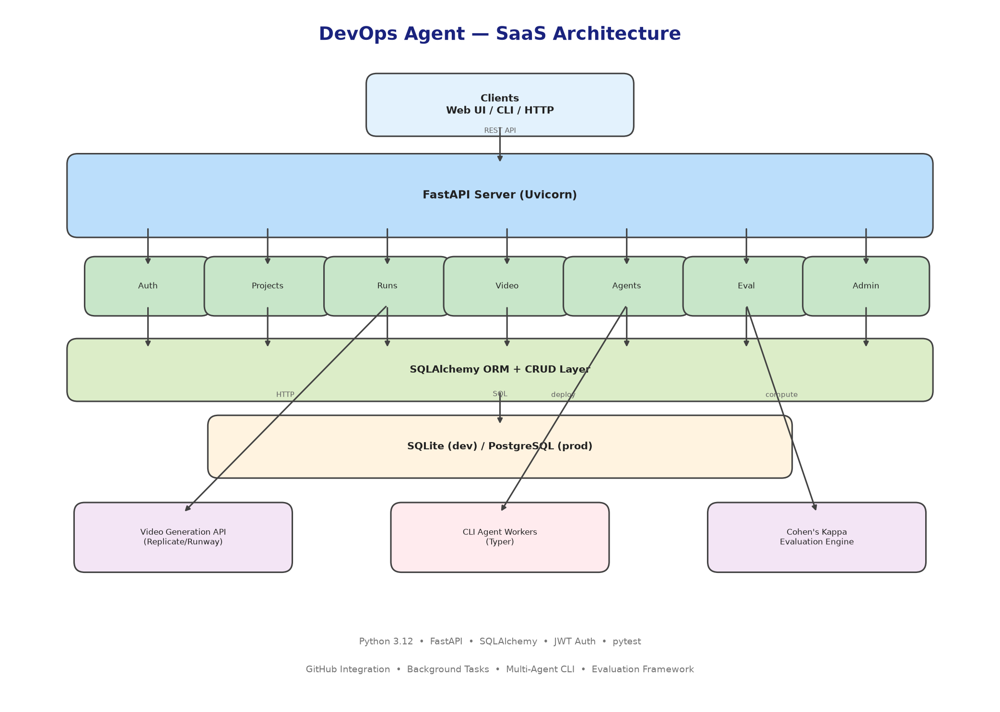
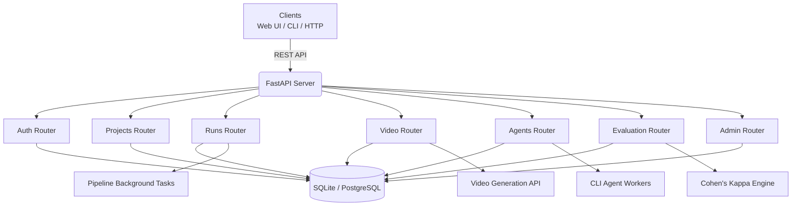

# 🚀 DevOps Agent — Multi-Agent DevOps Automation Platform


AI-powered multi-agent DevOps pipeline that generates production-grade infrastructure (Docker, Kubernetes, CI/CD, GitOps PRs) from any codebase — with policy validation, cost estimation, and an OODA-loop self-healer.

## Table of Contents

- [🏗️ Architecture](#️-architecture)
- [✨ Features](#-features)
- [🚀 Quick Start](#-quick-start)
- [📦 Installation](#-installation)
- [⚙️ Configuration](#️-configuration)
- [🔐 Authentication](#-authentication)
- [📊 Observability](#-observability)
- [🧪 Testing](#-testing)
- [☸️ Deployment](#️-deployment)
- [📁 Project Structure](#-project-structure)
- [📝 Documentation](#-documentation)
- [🤝 Contributing](#-contributing)
- [📄 License](#-license)

## 🏗️ Architecture





```
┌─────────────────────────────────────────────────────────────┐
│                     Clients                                 │
│              Web UI / CLI / HTTP API                        │
└─────────────────────────┬───────────────────────────────────┘
                          │ REST API
                          ▼
┌─────────────────────────────────────────────────────────────┐
│              FastAPI Application                            │
│  Auth ── Projects ── Runs ── Video ── Agents ── Eval ── Admin│
└─────────────────────────┬───────────────────────────────────┘
                          │ SQLAlchemy ORM
                          ▼
┌─────────────────────────────────────────────────────────────┐
│            SQLite / PostgreSQL Database                     │
└─────────────────────────────────────────────────────────────┘
```

## ✨ Features

### Core Engine
- 🔍 **Code Analysis** — Detects language, framework, and database stack (MongoDB, Postgres, Redis, etc.) from any project
- 🐳 **Docker Generation** — Production-grade multi-stage Dockerfiles
- ☸️ **Kubernetes Manifests** — Full K8s resources: Deployment, Service, ConfigMap, Secret, Ingress, NetworkPolicy
- 🔁 **CI/CD Pipelines** — Generated GitHub Actions workflows
- 🛡️ **Policy Validation** — Built-in policy engine validates generated artefacts against `policies/`
- 🔄 **GitOps PRs** — Opens pull requests directly to a GitOps repository
- 💰 **Cost Estimation** — Calculates monthly infrastructure cost for generated stacks
- 🩹 **OODA Self-Healer** — Observe/Orient/Decide/Act loop for debugging and retrying failing steps

### SaaS / API
- 🔑 **API Key Authentication** — SHA-256 hashed, scoped, expiring service-to-service keys
- 🪙 **JWT Authentication** — Bearer token login with user management
- 🗄️ **Alembic Migrations** — Versioned, reversible schema evolution
- 🪵 **Audit Logging** — Every CREATE / UPDATE / DELETE captured in `audit_logs`
- 🗑️ **Soft Deletes** — Records marked `deleted_at`, fully recoverable
- 🚦 **Rate limiting** — Per-IP limits (100/min reads, 20/min writes)
- 🛡️ **Security Headers** — HSTS, X-Content-Type-Options, X-Frame-Options, Referrer-Policy
- 📈 **Prometheus Metrics** — `/metrics` endpoint for scraping
- 🩺 **Health Checks** — `/health`, `/ready`, and deep `/health/deep` (DB + Redis + external APIs)
- ⚡ **Circuit Breakers & Timeouts** — External API calls fail fast after 5 consecutive errors

## 🚀 Quick Start

### CLI Mode — generate infra from a local project

```bash
python main.py --no-prompts --no-heal /path/to/project
```

Runs the multi-agent pipeline deterministically (no interactive prompts, no auto-heal) and writes artefacts under `outputs/`.

### Server Mode — run the SaaS API

```bash
python main.py --mode server --port 8000
```

FastAPI server available at `http://localhost:8000`. Interactive docs at `/api/docs`.

### Docker

```bash
docker build -t devops-agent .
docker run -p 8000:8000 devops-agent
```

The image runs as a non-root `appuser` and defaults to server mode on port 8000.

### Docker Compose (full stack with PostgreSQL + Redis)

```bash
docker compose up -d
```

## 📦 Installation

### Prerequisites

- **Python 3.10+** (Docker image targets 3.12)
- **Docker** (optional, for containerised runs)
- **Git**

### Local install

```bash
python3 -m venv venv
source venv/bin/activate
pip install -e ".[test]"
```

This installs the `devops-agent` console script plus the `test` extras (`pytest`, `pytest-cov`).

## ⚙️ Configuration

All settings are managed via [Pydantic Settings](https://docs.pydantic.dev/latest/concepts/pydantic_settings/) and can be supplied through environment variables or a local `.env` file (auto-loaded from the project root).

| Variable | Default | Description |
| --- | --- | --- |
| `DATABASE_URL` | `sqlite:///./devops_agent.db` | SQLAlchemy database URL. Use `postgresql+psycopg://...` in production. |
| `SERVER_HOST` | `0.0.0.0` | Bind host for the FastAPI server. |
| `SERVER_PORT` | `8000` | Bind port for the FastAPI server. |
| `ENVIRONMENT` | `development` | `development` runs auto-migrations on startup; `production` requires explicit migration. |
| `CORS_ALLOWED_ORIGINS` | `http://localhost:3000,http://localhost:5173` | Comma-separated list of allowed CORS origins. |
| `JWT_SECRET_KEY` | `dev-secret-change-in-production` | HMAC secret for signing JWTs — **must** be overridden in production. |
| `GITHUB_TOKEN` | _(unset)_ | Personal access token used by the GitOps agent to open PRs. |
| `LLM_PROVIDER_MODE` | `kimchi` | LLM backend: `local`, `kimchi`, or `remote`. Overridable via `--llm-mode`. |

Additional knobs worth knowing: `JWT_ACCESS_TOKEN_EXPIRE_MINUTES` (default 60), `MAX_REQUEST_BODY_SIZE_MB` (default 10), `RATE_LIMIT_DEFAULT` (`100/minute`), `RATE_LIMIT_WRITE` (`20/minute`), `REDIS_URL` (optional shared rate-limit store), `SENTRY_DSN` (optional error tracking), `LOG_JSON` (toggle structured JSON logs).

## 🔐 Authentication

### JWT (interactive users)

```bash
# Register
curl -X POST http://localhost:8000/api/v1/auth/register \
  -H "Content-Type: application/json" \
  -d '{"email":"alice@test.com","password":"secret123"}'

# Login → access_token
curl -X POST http://localhost:8000/api/v1/auth/login \
  -d "username=alice@test.com&password=secret123"

# Use as Bearer
curl http://localhost:8000/api/v1/projects/ \
  -H "Authorization: Bearer <TOKEN>"
```

### API Keys (service-to-service)

```bash
# Mint a key (returned once)
curl -X POST http://localhost:8000/api/v1/auth/api-keys/ \
  -H "Authorization: Bearer <TOKEN>" \
  -H "Content-Type: application/json" \
  -d '{"name":"ci-key"}'

# Use the key directly — no JWT needed
curl http://localhost:8000/api/v1/projects/ \
  -H "X-API-Key: da_<your-key-here>"
```

Keys are SHA-256 hashed at rest, can be scoped, and may carry an expiry.

### Rate Limiting

- **Read endpoints** (`projects`, `runs`, `agents` listings): 100 requests / minute / IP.
- **Write endpoints** (`auth`, and any state-changing call): 20 requests / minute / IP.
- Optionally backed by Redis (`REDIS_URL`) for multi-instance deployments.
- Returns `HTTP 429 Rate limit exceeded` when triggered.

## 📊 Observability

| Endpoint | Purpose |
| --- | --- |
| `GET /metrics` | Prometheus exposition (request count, latency histograms, status codes). |
| `GET /api/v1/admin/health` | Liveness probe. |
| `GET /api/v1/admin/ready` | Readiness probe (DB ready). |
| `GET /api/v1/admin/health/deep` | Deep health — DB, Redis, and external API latency diagnostics. |

Logs go through [Loguru](https://github.com/Delgan/loguru) and can be switched to JSON via `LOG_JSON=true`.

## 🧪 Testing

```bash
pytest tests/ -v
```

The suite ships **108 passing tests** covering:

- **API** — `test_api_auth.py`, `test_api_projects.py`, `test_api_runs.py`, `test_api_video.py`, `test_api_agents.py`, `test_api_evaluation.py`
- **Engine** — `test_compiler_pipeline.py`, `test_v2_modules.py`, `test_exit_codes.py`, `test_idempotency.py`
- **Policy** — `test_policy.py`, `test_policy_engine.py`, `test_integrity_audit.py`
- **Tools** — `test_tools_file_ops.py`, `test_db_detection.py`, `test_sanitizer.py`, `test_secrets.py`
- **K8s completeness** — `test_k8s_completeness.py`, `test_k8s_prompts.py`
- **Cost, memory, OODA healer** — `test_cost_agent.py`, `test_memory.py`, `test_ooda_healer.py`

For HTTP smoke tests against a live server, see `CONTRIBUTING.md`.

## ☸️ Deployment

The project ships first-class deployment manifests for every common target. See [`docs/deploy.md`](docs/deploy.md) for the full guide.

### Docker Compose (single host)

```bash
docker compose up -d
```

### Kubernetes (raw manifests)

```bash
kubectl apply -f k8s/
```

Includes namespace, configmap, secret, deployment, service, ingress, and network policy.

### Helm

```bash
helm install devops-agent ./helm/devops-agent --namespace devops-agent --create-namespace
```

### ArgoCD (GitOps)

```bash
kubectl apply -f argocd/application.yaml
```

Secrets should always be injected via Kubernetes Secrets or an external manager (Sealed Secrets, Vault). Never commit secrets to git.

## 📁 Project Structure

```
devops_agent/
├── main.py                       # CLI / server entry point
├── run_agent.sh                  # Container entrypoint helper
├── pyproject.toml                # Project metadata & deps
├── requirements.txt
├── alembic/                      # Database migrations
├── alembic.ini
├── docker-compose.yml            # Full local stack
├── Dockerfile                    # Multi-stage production image
├── docker-entrypoint.sh
├── cli/                          # Legacy CLI scripts
├── src/
│   ├── cli/                      # Interactive CLI logic
│   ├── entrypoints/              # cli_main.py / server_main.py
│   ├── api/                      # FastAPI app, routers, middleware
│   │   └── routers/              # auth, projects, runs, video, agents, evaluation, admin, apikeys, metrics
│   ├── engine/                   # Pipeline orchestrator
│   ├── decision_engine/          # OODA decision logic
│   ├── agents/                   # Agent implementations
│   ├── tools/                    # Tool integrations
│   ├── policy/                   # Policy validation
│   ├── gitops/                   # GitOps PR automation
│   ├── db/                       # SQLAlchemy models & CRUD
│   ├── observability/            # Logging, metrics, health
│   ├── llm_clients/              # LLM provider adapters
│   ├── memory/                   # Conversation / vector memory
│   ├── services/                 # Shared services
│   ├── integrations/             # External API clients
│   ├── crud/, models/, schemas/  # Data layer
│   ├── audit/                    # Audit log subsystem
│   ├── utils/                    # Circuit breaker, timeouts
│   ├── web/static/               # Static UI assets
│   └── config/settings.py
├── k8s/                          # Raw Kubernetes manifests
├── helm/devops-agent/            # Helm chart
├── argocd/                       # ArgoCD Application
├── configs/                      # Default runtime configs
├── policies/                     # Policy bundles
├── sample-node-app/              # Demo target application
├── tests/                        # pytest suite (108 tests)
├── scripts/                      # init_db, http smoke tests, generators
├── docs/                         # architecture, user-guide, api-reference, deploy
├── reports/, outputs/, logs/     # Runtime artefacts
└── venv/                         # Local virtualenv (gitignored)
```

## 📝 Documentation

- [Architecture](docs/architecture.md)
- [User Guide](docs/user-guide.md)
- [API Reference](docs/api-reference.md)
- [Deployment Guide](docs/deploy.md)
- [Contributing](CONTRIBUTING.md)
- [Secrets Reference](SECRETS_REFERENCE.md)

## 🤝 Contributing

We welcome contributions — bug fixes, new agents, additional policy bundles, and infra generation patterns. Fork the repo, create a feature branch, install the dev extras with `pip install -e ".[test]"`, run `pre-commit install` (then `pre-commit run --all-files`), and open a PR. Please include tests for any new behaviour. For full guidelines see [CONTRIBUTING.md](CONTRIBUTING.md).

## 📄 License

Released under the [MIT License](LICENSE).
